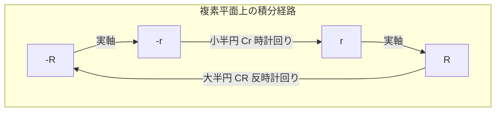

# 数学検定1級 一次試験（計算技能）詳細解説＆解説書（理論マニュアル）

本解説書は、これまで作成した模擬試験（第1回〜第7回、全49問）および主要な問題について、計算の裏付けとなる**「数学的理論」**、**「途中式の詳細な展開」**、および**「試験における典型的な落とし穴・テクニック」**を分野別に体系化して解説したものです。

---

## 目次

1. **微分積分学 (Calculus)**
   - ベータ関数・ガンマ関数と相反公式の応用
   - 累次積分における積分順序の変更テクニック
   - 曲線長と包絡線の方程式の導出
2. **線形代数 (Linear Algebra)**
   - 特殊な行列式の因数分解・固有値との関係
   - ケーリー・ハミルトンの定理を用いた次数下げアルゴリズム
   - 2次形式の正定値性とシルベスターの基準
3. **微分方程式 (Differential Equations)**
   - ベルヌーイ形および同次形微分方程式の変数変換
   - クレローの微分方程式と特異解（包絡線）
   - 定数変化法の完全な導出と適用
4. **複素解析 (Complex Analysis)**
   - 実軸上に極を持つ複素積分の経路（切り込み半円）
   - コーシーの積分公式（高階微分）と留数計算
   - 一次分数変換（メビウス変換）の決定手法
5. **ベクトル解析 (Vector Calculus)**
   - 面積分（フラックス）の直接計算と発散定理の対比
   - 方向微分係数と勾配（Grad）ベクトルの幾何学的意味
6. **代数学・整数論 (Algebra & Number Theory)**
   - 置換群（対称群）における共役写像の代数構造
   - 多項式環の剰余環と体の同型（第一同型定理）
   - 合同式とオイラーの定理の応用
7. **確率・統計 (Probability & Statistics)**
   - 確率変数の変数変換（CDF-PDF変換）
   - カイ二乗分布による母分散の区間推定の理論
   - 標本統計量（$t$ 値および $F$ 値）と仮説検定の解釈

---
---

## 1. 微分積分学 (Calculus)

### ◆ ベータ関数・ガンマ関数と相反公式の応用
広義積分において、有理関数や指数関数を特殊関数に帰着させるパターンは頻出です。

#### 1. ベータ関数とガンマ関数の定義・関係性
$$B(p, q) = \int_0^1 x^{p-1}(1-x)^{q-1} \,dx = \int_0^{\infty} \frac{t^{p-1}}{(1+t)^{p+q}} \,dt \quad (\operatorname{Re}(p)>0, \operatorname{Re}(q)>0)$$
$$\Gamma(z) = \int_0^{\infty} t^{z-1} e^-t \,dt \quad (\operatorname{Re}(z)>0)$$
$$B(p, q) = \frac{\Gamma(p)\Gamma(q)}{\Gamma(p+q)}$$

#### 2. 相反公式（Reflection Formula）
分母・分子に $\pi$ や $\sqrt{3}$ などの定数が現れる計算の多くは、以下の相反公式が根拠となっています。
$$\Gamma(z)\Gamma(1-z) = \frac{\pi}{\sin(\pi z)} \quad (z \notin \mathbb{Z})$$

#### 【詳細導出例：問題1より】
$$I = \int_{0}^{\infty} \frac{x}{(1+x^3)^2} \,dx$$
$x^3 = t \implies x = t^{1/3} \implies dx = \frac{1}{3}t^{-2/3} \,dt$ の置換を行うと、
$$I = \frac{1}{3} \int_0^{\infty} \frac{t^{1/3}}{(1+t)^2} t^{-2/3} \,dt = \frac{1}{3} \int_0^{\infty} \frac{t^{\frac{2}{3}-1}}{(1+t)^{\frac{2}{3} + \frac{4}{3}}} \,dt = \frac{1}{3} B\left(\frac{2}{3}, \frac{4}{3}\right)$$
ここで関係式を用いると、 $\Gamma\left(\frac{2}{3} + \frac{4}{3}\right) = \Gamma(2) = 1$ より、
$$B\left(\frac{2}{3}, \frac{4}{3}\right) = \Gamma\left(\frac{2}{3}\right)\Gamma\left(\frac{4}{3}\right) = \Gamma\left(\frac{2}{3}\right) \cdot \frac{1}{3}\Gamma\left(\frac{1}{3}\right) = \frac{1}{3} \left( \Gamma\left(\frac{1}{3}\right)\Gamma\left(1 - \frac{1}{3}\right) \right)$$
相反公式を $z = \frac{1}{3}$ で適用すると、
$$\Gamma\left(\frac{1}{3}\right)\Gamma\left(\frac{2}{3}\right) = \frac{\pi}{\sin(\pi/3)} = \frac{2\pi}{\sqrt{3}} = \frac{2\sqrt{3}}{3}\pi$$
よって、
$$I = \frac{1}{3} \cdot \frac{1}{3} \cdot \frac{2\sqrt{3}}{3}\pi = \frac{2\sqrt{3}}{27}\pi$$

---

### ◆ 累次積分における積分順序の変更テクニック
初等関数で積分できない関数（例： $e^{-x^2}, \frac{\sin x}{x}, \cos(y^2)$ など）を含む累次積分は、積分順序を変更することで極めて容易に解くことができます。

#### 順序変更の手順
1. **領域 $D$ の正確な図示**：不等式から、 $xy$ 平面上の領域の境界を特定し、グラフを描きます。
2. **スライスの方向の変更**：
   * 元の積分が $y$ を外側、 $x$ を内側（$x$ について先に積分）にしている場合（$y$ 方向のスライス）：
     $$D = \{ (x, y) \mid c \le y \le d, \; h_1(y) \le x \le h_2(y) \}$$
   * これを $x$ を外側、 $y$ を内側にする表現に書き換えます（$x$ 方向のスライス）：
     $$D = \{ (x, y) \mid a \le x \le b, \; g_1(x) \le y \le g_2(x) \}$$

#### 【詳細展開例：第6回問題1より】
$$I = \int_{0}^{1} \int_{y}^{1} e^{-x^2} \,dx\,dy$$
この積分の領域は $D = \{ (x, y) \mid 0 \le y \le 1, \; y \le x \le 1 \}$ です。これは $y=0, x=1, y=x$ で囲まれた三角形です。
この領域を $x$ の範囲を先に固定して表現すると、 $x$ は $0$ から $1$ まで動き、そのときの $y$ は $0$ から $x$ まで動くため、
$$D = \{ (x, y) \mid 0 \le x \le 1, \; 0 \le y \le x \}$$
となります。
$$I = \int_{0}^{1} \left( \int_{0}^{x} e^{-x^2} \,dy \right) \,dx = \int_{0}^{1} \left[ y e^{-x^2} \right]_0^x \,dx = \int_{0}^{1} x e^{-x^2} \,dx$$
$u = -x^2 \implies dx = -\frac{1}{2x}du$ より、
$$I = \left[ -\frac{1}{2} e^{-x^2} \right]_0^1 = -\frac{1}{2e} - \left(-\frac{1}{2}\right) = \frac{1}{2}\left(1 - \frac{1}{e}\right) = \frac{e-1}{2e}$$

---

### ◆ 曲線長と包絡線の方程式の導出
#### 1. 媒介変数曲線の長さ
曲線 $(x(t), y(t))$ の長さの公式は以下で与えられます。
$$L = \int_a^b \sqrt{\left(\frac{dx}{dt}\right)^2 + \left(\frac{dy}{dt}\right)^2} \,dt$$
ここで、根号の中を整理する際に**半角公式**や**2倍角公式**を用いて平方完成を行い、根号を外すのが定石です。

#### 2. 包絡線の求め方
曲線族 $F(x, y, C) = 0$ （$C$ はパラメータ）の包絡線は、次の連立方程式から $C$ を消去することで得られます。
$$\begin{cases}
F(x, y, C) = 0 \\
\frac{\partial F}{\partial C}(x, y, C) = 0
\end{cases}$$

---
---

## 2. 線形代数 (Linear Algebra)

### ◆ 特殊な行列式の因数分解・固有値との関係
数検1級で出題される行列式は、$n \times n$ の構造を持つものや、巡回行列、対称性を備えたものが中心です。

#### 1. 巡回行列式（Circulant Determinant）の解法
すべての行が、前の行を右に巡回シフトさせたものである行列の行列式は、1の $n$ 乗根 $\omega$ を用いて因数分解できます。

#### 2. すべての対角成分が $x$ 、非対角成分が $a$ の行列式（第4回問題2）
$$D = \begin{vmatrix}
x & a & a & a \\
a & x & a & a \\
a & a & x & a \\
a & a & a & x
\end{vmatrix}$$
この行列 $M$ は、単位行列 $I$ とすべての成分が 1 の行列 $J$ を用いて次のように表せます。
$$M = (x - a)I + aJ$$
行列 $J$ のサイズは $4 \times 4$ です。 $J$ の固有値は、トレース（対角和）が 4 であることから $4$ （重複度1）と $0$ （重複度3）になります。
したがって、 $M$ の固有値は、
* $(x - a) + 4a = x + 3a$ （重複度1）
* $(x - a) + 0 = x - a$ （重複度3）
となります。
行列式の値はすべての固有値の積に等しいため、直ちに以下が得られます。
$$\det(M) = (x+3a)(x-a)^3$$

---

### ◆ ケーリー・ハミルトンの定理を用いた次数下げアルゴリズム
正方行列 $A$ に対し、 $A^n$ や高次の行列多項式 $P(A)$ を計算する場合、ケーリー・ハミルトンの定理を用いて次数を下げることが最も効率的です。

#### アルゴリズム手順
1. **特性多項式の計算**： $p(\lambda) = \det(A - \lambda I) = \lambda^2 - \operatorname{tr}(A)\lambda + \det(A)$
2. **定理の適用**： $p(A) = O$
3. **多項式の除法**： 与えられた多項式 $P(x)$ を $p(x)$ で割った余りを $R(x)$ （割る式が2次なら余りは1次以下）とします。
   $$P(x) = Q(x)p(x) + R(x)$$
4. **代入**： $x = A$ を代入すると、 $p(A) = O$ なので、 $P(A) = R(A)$ となり、低次式の計算のみに帰着されます。

---

### ◆ 2次形式の正定値性とシルベスターの基準
実対称行列 $A$ に付随する2次形式 $q(\mathbf{x}) = \mathbf{x}^T A \mathbf{x}$ が正定値であるための条件は、線形代数の重要テーマです。

#### シルベスターの基準（Sylvester's Criterion）
実対称行列 $A$ が正定値（任意の $\mathbf{x} \neq \mathbf{0}$ に対して $\mathbf{x}^T A \mathbf{x} > 0$）であるための必要十分条件は、**すべての首座小行列式（左上からの部分行列式）が正**であることです。
$$D_k = \begin{vmatrix}
a_{11} & \dots & a_{1k} \\
\vdots & \ddots & \vdots \\
a_{k1} & \dots & a_{kk}
\end{vmatrix} > 0 \quad (k = 1, 2, \dots, n)$$

---
---

## 3. 微分方程式 (Differential Equations)

### ◆ ベルヌーイ形および同次形微分方程式の変数変換
非線形常微分方程式の中で、特定の変数変換により線形常微分方程式に変換できる代表例が「ベルヌーイの微分方程式」と「同次形微分方程式」です。

#### 1. ベルヌーイの微分方程式（Bernoulli ODE）
$$y' + P(x)y = Q(x)y^n \quad (n \neq 0, 1)$$
* **変換式**： $u = y^{1-n}$ とおきます。
* **導関数**： $u' = (1-n)y^{-n}y'$ です。
* これを元の式の両辺を $y^n$ で割った式に代入すると、以下の $u$ に関する1階線形微分方程式に変換されます。
  $$\frac{1}{1-n} u' + P(x)u = Q(x)$$

#### 2. 同次形微分方程式（Homogeneous ODE）
$$y' = f\left(\frac{y}{x}\right)$$
* **変換式**： $u = \frac{y}{x} \implies y = ux$ とおきます。
* **導関数**： 積の微分より、 $y' = u + x u'$ です。
* これを代入すると、変数分離形微分方程式に変換されます。
  $$u + x u' = f(u) \implies x \frac{du}{dx} = f(u) - u \implies \frac{du}{f(u) - u} = \frac{dx}{x}$$

---

### ◆ クレローの微分方程式と特異解（包絡線）
$$y = x y' + f(y')$$
この微分方程式は、一般解と特異解の両方を持ち、一次試験・二次試験ともに極めて出題率が高いパターンです。

#### 解法プロセス
両辺を $x$ で微分します（$y' = p$ とおきます）。
$$p = p + x \frac{dp}{dx} + f'(p)\frac{dp}{dx} \implies (x + f'(p))\frac{dp}{dx} = 0$$
* **ケースA**： $\frac{dp}{dx} = 0 \implies p = C$ （定数）
  元の式に代入すると、直線族である**一般解**が得られます。
  $$y = C x + f(C)$$
* **ケースB**： $x + f'(p) = 0$
  $p$ を媒介変数として、 $\begin{cases} x = -f'(p) \\ y = -p f'(p) + f(p) \end{cases}$ から $p$ を消去すると、一般解の包絡線（直線群が形作る曲線）である**特異解**が得られます。

---

### ◆ 定数変化法の完全な導出と適用
定数係数でなくても使用できる非同次線形微分方程式の強力な解法です。

#### 2階線形微分方程式への適用
$$y'' + P(x)y' + Q(x)y = f(x)$$
同次方程式の基本解を $y_1(x), y_2(x)$ とします。特解を $y_p(x) = u_1(x)y_1(x) + u_2(x)y_2(x)$ と仮定します。
パラメータに関する制限条件として $u_1' y_1 + u_2' y_2 = 0$ を課すと、微分方程式への代入により次の連立方程式が得られます。
$$\begin{pmatrix} y_1 & y_2 \\ y_1' & y_2' \end{pmatrix} \begin{pmatrix} u_1' \\ u_2' \end{pmatrix} = \begin{pmatrix} 0 \\ f(x) \end{pmatrix}$$
クラメルの公式（Cramer's Rule）より、
$$u_1' = \frac{\begin{vmatrix} 0 & y_2 \\ f(x) & y_2' \end{vmatrix}}{W(x)} = -\frac{y_2(x)f(x)}{W(x)}, \quad u_2' = \frac{\begin{vmatrix} y_1 & 0 \\ y_1' & f(x) \end{vmatrix}}{W(x)} = \frac{y_1(x)f(x)}{W(x)}$$
ただし、 $W(x) = y_1 y_2' - y_2 y_1'$ （ロンスキアン）です。
これを積分することで、特解を与える $u_1(x), u_2(x)$ が求まります。

---
---

## 4. 複素解析 (Complex Analysis)

### ◆ 実軸上に極を持つ複素積分の経路（切り込み半円）
有理関数や三角関数の広義積分において、極（分母が $0$ になる点）が積分経路である実数軸上（通常は原点 $z=0$）に存在する場合、その点を通る経路を避ける必要があります。

#### 積分経路の設定（第6回問題4）
積分 $\int_{-\infty}^{\infty} \frac{\sin x}{x} \,dx$ では、複素関数 $f(z) = \frac{e^{iz}}{z}$ を考えます。極 $z=0$ を避けるため、上半平面に以下の経路 $C$ を構築します。
1. 実軸に沿って： $[-R, -r]$
2. 原点を避ける： 半径 $r$ の小半円 $C_r$ （時計回り）
3. 実軸に沿って： $[r, R]$
4. 上半平面を閉じる： 半径 $R$ の大半円 $C_R$ （反時計回り）

#### 留数定理と極限の計算
留数定理より、閉曲線 $C$ の内部に極はないため、 $\oint_C f(z) \,dz = 0$ です。
* **小半円の極限**： 1位の極 $z=a$ を中心とする角度 $\theta$ の円弧上の積分極限は、 $\lim_{r\to0} \int_{C_r} f(z) \,dz = i\theta \operatorname{Res}(f, a)$ になります。
  本問では時計回り（$\theta = -\pi$）なので、 $\lim_{r\to0} \int_{C_r} = -i\pi \operatorname{Res}(f, 0) = -i\pi$ となります。
* **大半円の極限**： $R \to \infty$ のとき $0$ に収束します（ジョルダンの補題）。
したがって、
$$\int_{-\infty}^{\infty} \frac{e^{ix}}{x} \,dx - i\pi = 0 \implies \int_{-\infty}^{\infty} \frac{\sin x}{x} \,dx = \operatorname{Im}(i\pi) = \pi$$

---

### ◆ コーシーの積分公式（高階微分）と留数計算
#### 高階微分公式
$$f^{(n)}(a) = \frac{n!}{2\pi i} \oint_C \frac{f(z)}{(z-a)^{n+1}} \,dz$$
この公式は、特異点の周辺でのローラン展開における $1/(z-a)$ の係数（留数）を計算することと本質的に同一です。留数は、極の位数 $m$ に応じて以下の微分公式で計算できます。
$$\operatorname{Res}(f, a) = \frac{1}{(m-1)!} \lim_{z \to a} \frac{d^{m-1}}{dz^{m-1}} [ (z-a)^m f(z) ]$$

---
---

## 5. ベクトル解析 (Vector Calculus)

### ◆ 面積分（フラックス）の直接計算と発散定理の対比
曲面 $S$ を通るベクトル場 $\mathbf{F}$ のフラックスの計算には、「発散定理（Divergence Theorem）」を使う方法と、「面積分を直接実行する」方法の2種類があり、数検1級では両方の指定が出題されます。

#### 1. 発散定理による計算
閉曲面 $S$ に囲まれた領域を $V$ とするとき、
$$\iint_S \mathbf{F} \cdot \mathbf{n} \,dS = \iiint_V (\nabla \cdot \mathbf{F}) \,dV$$

#### 2. 直接積分による計算（第7回問題5）
曲面 $S$ が $z = g(x, y)$ （定義域 $D$）で与えられるとき、
$$\iint_S \mathbf{F} \cdot \mathbf{n} \,dS = \iint_D \mathbf{F}(x, y, g(x,y)) \cdot \left( -g_x, \; -g_y, \; 1 \right) \,dx\,dy$$
※法線ベクトルが上向きの場合の公式です。
直接積分の利点は、球面、円柱面などの対称性を利用して極座標や円柱座標に適切に変換し、スカラーの2重積分に持ち込める点にあります。

---

### ◆ 方向微分係数と勾配（Grad）ベクトルの幾何学的意味
多変数関数 $f(\mathbf{x})$ の点 $P$ における、単位方向ベクトル $\mathbf{e}$ （$\|\mathbf{e}\|=1$）方向の傾きを表すのが「方向微分係数」です。
$$D_{\mathbf{e}} f(P) = \nabla f(P) \cdot \mathbf{e}$$
* **最大傾斜方向**：方向微分係数が最大になるのは、 $\mathbf{e}$ が勾配ベクトル $\nabla f(P)$ と同じ向きを向いているときであり、その最大値はノルム $\|\nabla f(P)\|$ に等しくなります。
* **等高線との直交**： $\nabla f(P)$ は、点 $P$ を通る等高線（あるいは等高面）の接線と常に直交します。

---
---

## 6. 代数学・整数論 (Algebra & Number Theory)

### ◆ 置換群（対称群）における共役写像の代数構造
対称群 $S_n$ における共役変換 $\tau \sigma \tau^{-1}$ は、群論における基本演算です。

#### 巡回置換の置き換え定理
置換 $\sigma$ が巡回置換 $(a_1 \; a_2 \; \dots \; a_k)$ であるとき、任意の置換 $\tau$ による共役置換 $\tau \sigma \tau^{-1}$ は、各要素を $\tau$ で写した巡回置換になります。
$$\tau (a_1 \; a_2 \; \dots \; a_k) \tau^{-1} = (\tau(a_1) \; \tau(a_2) \; \dots \; \tau(a_k))$$

#### 【証明のスケッチ】
$\mu = \tau \sigma \tau^{-1}$ とおきます。任意の要素 $x$ に対し、 $x$ が $\tau(a_i)$ の形で表せる場合とそうでない場合に分けて考えます。
* **ケース1**： $x = \tau(a_i)$ のとき
  $$\mu(\tau(a_i)) = (\tau \sigma \tau^{-1})(\tau(a_i)) = \tau(\sigma(a_i))$$
  ここで、 $\sigma(a_i) = a_{i+1}$ （ただし $a_k$ のときは $a_1$）なので、
  $$\mu(\tau(a_i)) = \tau(a_{i+1})$$
  これは、巡回置換 $(\tau(a_1) \; \tau(a_2) \; \dots \; \tau(a_k))$ の作用と完全に一致します。
* **ケース2**： $x$ がどの $\tau(a_i)$ とも等しくないとき（すなわち $\tau^{-1}(x) \notin \{a_1, \dots, a_k\}$）
  $\sigma$ の作用によって $\tau^{-1}(x)$ は不変なので、 $\sigma(\tau^{-1}(x)) = \tau^{-1}(x)$ です。
  $$\mu(x) = \tau(\sigma(\tau^{-1}(x))) = \tau(\tau^{-1}(x)) = x$$
  要素 $x$ は不変です。

これより、定理が証明されます。この定理を用いることで、複雑な置換の合成計算を瞬時に行うことができます。

---

### ◆ 多項式環の剰余環と体の同型（第一同型定理）
剰余環 $R/I$ の構造を明らかにするための最も確実なアプローチが「準同型定理」です。

#### 環の第一同型定理（First Isomorphism Theorem for Rings）
環の全射準同型写像 $\phi: R \to S$ が存在するとき、次が成り立ちます。
$$R/\operatorname{Ker}(\phi) \cong S$$

#### 実数体 $\mathbb{R}$ と複素数体 $\mathbb{C}$ の関係の証明（問題11 / 第7回問題6）
多項式環 $\mathbb{R}[x]$ から複素数体 $\mathbb{C}$ への代入写像 $\phi(p(x)) = p(i)$ を定義します。
* **準同型性**：代入演算は和と積を保存するため、 $\phi$ は環準同型です。
* **全射性**：任意の複素数 $a+bi$ に対し、 $a+bx \in \mathbb{R}[x]$ を選べば $\phi(a+bx) = a+bi$ となり、全射です。
* **核（Kernel）**： $\operatorname{Ker}(\phi) = \{ p(x) \in \mathbb{R}[x] \mid p(i) = 0 \}$ です。実数係数多項式において $p(i)=0 \implies p(-i)=0$ となるため、 $p(x)$ は複素共役の根を持ち、必ず $(x-i)(x+i) = x^2+1$ で割り切れます。したがって、 $\operatorname{Ker}(\phi) = (x^2+1)$ です。
* **結論**：準同型定理より、 $\mathbb{R}[x]/(x^2+1) \cong \mathbb{C}$ となります。

---
---

## 7. 確率・統計 (Probability & Statistics)

### ◆ 確率変数の変数変換（CDF-PDF変換）
確率変数 $X$ から新たな確率変数 $Y = g(X)$ を作るとき、 $Y$ の確率密度関数 $f_Y(y)$ を求める手法には、「累積分布関数を経由する方法」と「ヤコビアン公式を用いる方法」があります。

#### 累積分布関数（CDF）を経由する方法
1. **$Y$ の累積分布関数の立式**：
   $$F_Y(y) = P(Y \le y) = P(g(X) \le y)$$
2. **$X$ の不等式への変形**： $g(X) \le y$ を $X$ に関する不等式（例： $X \le g^{-1}(y)$ など）に整理します。このとき、関数 $g$ の単調増加・単調減少に注意し、不等号の向きを正しく判定します。
3. **積分による計算**： 一致する $X$ の確率密度関数 $f_X(x)$ の積分範囲から $F_Y(y)$ を具体的に求めます。
4. **微分による密度関数の決定**： 確率密度関数は累積分布関数の導関数なので、 $y$ で微分します。
   $$f_Y(y) = \frac{d}{dy} F_Y(y)$$

---

### ◆ カイ二乗分布による母分散の区間推定の理論
正規母集団 $N(\mu, \sigma^2)$ からの標本において、母分散 $\sigma^2$ の推定値として不偏分散 $s^2 = \frac{1}{n-1}\sum(X_i - \bar{X})^2$ を用います。

#### カイ二乗統計量の導出
確率変数 $X_i$ を標準化すると $Z_i = \frac{X_i - \mu}{\sigma} \sim N(0, 1)$ となり、その平方和 $\sum Z_i^2 = \frac{\sum(X_i - \mu)^2}{\sigma^2}$ は自由度 $n$ のカイ二乗分布に従います。
しかし、母平均 $\mu$ が未知の場合、 $\mu$ を標本平均 $\bar{X}$ に置き換える必要があります。この置き換えにより自由度が 1 減少し、次の統計量が自由度 $n-1$ のカイ二乗分布に従うことになります（コホランの定理の帰結）。
$$\chi^2 = \frac{(n-1)s^2}{\sigma^2} \sim \chi^2(n-1)$$

#### 信頼区間の構成
信頼係数 $1-\alpha$ の信頼区間は、カイ二乗分布のパーセント点を用いて以下のように挟み込まれます。
$$\chi^2_{1-\alpha/2}(n-1) \le \frac{(n-1)s^2}{\sigma^2} \le \chi^2_{\alpha/2}(n-1)$$
逆数をとって $\sigma^2$ について整理することで、以下の区間推定公式が得られます。
$$\frac{(n-1)s^2}{\chi^2_{\alpha/2}(n-1)} \le \sigma^2 \le \frac{(n-1)s^2}{\chi^2_{1-\alpha/2}(n-1)}$$
※分母の大小関係が逆転することに注意してください（大きな値で割った方が小さくなります）。
